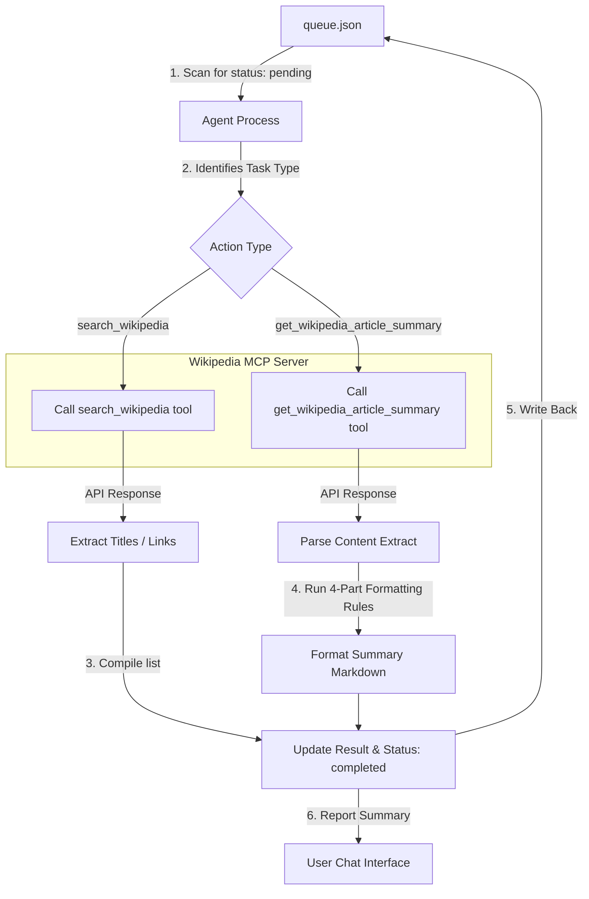

# Wikipedia MCP Detailed Workflow Guide

This document defines the comprehensive step-by-step workflow for the Wikipedia Model Context Protocol (MCP) server. It outlines how the agent processes pending tasks from the queue, interacts with MCP tools, parses payloads, structures summaries, and handles errors.

---

## 1. System Architecture & Data Flow

Below is the workflow pipeline illustrating how tasks flow from the JSON queue, get executed through the Wikipedia MCP server, and return structured output back to the queue.



---

## 2. Step-by-Step Execution Protocol

When executing the workflow, the agent must perform the following tasks sequentially:

### Step 2.1: Task Scanning & Filtering
1. Read the raw text of [queue.json](file:///c:/Users/vaish/OneDrive/it/wikipedia%20mcp/queue.json) and parse it as a JSON object.
2. Locate the `"tasks"` array.
3. Filter tasks where `"status"` matches `"pending"`. If no tasks are pending, terminate the workflow and notify the user.

### Step 2.2: Action Classification & Tool Call
For each pending task, determine the `"action"` and prepare arguments:

*   **Case A: `"search_wikipedia"`**
    *   **Arguments**: Extract `"query"` (string) and `"limit"` (integer, default `3`) from `"params"`.
    *   **Tool**: Call `wikipedia/search_wikipedia` (lazy tool).
*   **Case B: `"get_wikipedia_article_summary"`**
    *   **Arguments**: Extract `"title"` (string) from `"params"`.
    *   **Tool**: Call `wikipedia/get_wikipedia_article_summary` (lazy tool).

### Step 2.3: Summary Parsing & Restructuring (Critical)
When processing summaries, the raw text returned by the tool must be reformatted into a structured layout:

1.  **Extract Body**: Strip any surrounding wrapper labels like `Title:` and `Link:` to isolate the text block under `Summary:`.
2.  **Sentence Splitting**: Split the summary extract into individual sentences using a regex pattern like `\.(?=\s|$)` to preserve abbreviations while isolating sentences.
3.  **Build the 4-Part Structure**:
    *   `**Topic:**` State the focus in a short phrase (e.g., `The Wikipedia page for Artificial intelligence`).
    *   `**Timeline:**` Extract any 4-digit years from the text (e.g., `2024, 2026`). If no years or dates exist, state exactly: `No specific dates - this is a general overview.`
    *   `**Subject:**` Present exactly one sentence defining the core topic (typically the first sentence).
    *   `**Explanation:**` Provide exactly 5 sentences expanding on the Subject, highlighting context, key details, or impact.

### Step 2.4: Queue State Persistence
1.  Overwrite the processed task's `"status"` to `"completed"` (or `"failed"` if an error occurs).
2.  Add or update `"updated_at"` with the ISO UTC timestamp (e.g., `"2026-06-19T10:21:00Z"`).
3.  Save the formatted string into `"result"`.
4.  Write the updated JSON object back to [queue.json](file:///c:/Users/vaish/OneDrive/it/wikipedia%20mcp/queue.json).

---

## 3. Error Handling Matrix

The workflow must recover gracefully from downstream API failures:

| Scenario | Root Cause | Handling Strategy | Status Saved |
| :--- | :--- | :--- | :--- |
| **Page Not Found** | Wikipedia returns a 404 for the title | Log warning, save: `"Article '<title>' not found on Wikipedia. Please try searching for the correct title first."` | `completed` |
| **Connection Timeout** | Network issue or Wikipedia API down | Retry once; if failed, save: `"Error: Connection timed out."` | `failed` |
| **Invalid Action** | Queue task has unsupported `"action"` | Save: `"Error: Unsupported action '<action>'."` | `failed` |

---

## 4. Operational Example

### Queue Input Task
```json
{
  "id": "wiki_task_5",
  "action": "get_wikipedia_article_summary",
  "params": {
    "title": "Machine learning"
  },
  "status": "pending",
  "created_at": "2026-06-19T10:22:00Z"
}
```

### Resulting Formatted Summary in `"result"`
```markdown
**Topic:** The Wikipedia page for Machine learning

**Timeline:** 1959, 2026

**Subject:** Machine learning (ML) is a field of study in artificial intelligence concerned with the development and study of statistical algorithms that can learn from data and generalize to unseen data.

**Explanation:** The term machine learning was coined in 1959 by Arthur Samuel, an IBM employee and pioneer in computer gaming and artificial intelligence. Modern applications include natural language processing, computer vision, and autonomous vehicle control. Algorithms analyze training sets to detect hidden patterns and make decisions. As models process more data, their performance metrics improve dynamically over time. This makes machine learning one of the fastest-growing sectors in tech today.
```
